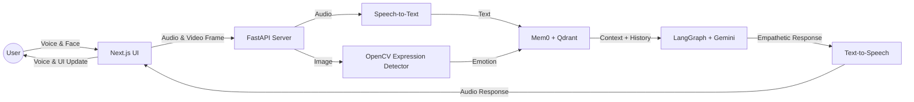

# AvaCare
### *Your Empathetic AI Health Companion*

 

> *"AvaCare isn't just a chatbot. It's a companion that sees you, hears you, and remembers you."*

---

## 🌟 Overview

**AvaCare** is a revolutionary health assistant that bridges the gap between human emotion and artificial intelligence. By integrating **real-time facial expression recognition**, **natural voice synthesis**, and **long-term semantic memory**, AvaCare provides a level of empathy and context awareness previously unattainable in automated systems.

It doesn't just process your words; it understands your mood, remembers your history, and responds with genuine care.

---

## ✨ Key Features

| Feature | Description |
| :--- | :--- |
| **🧠 Emotional Intelligence** | Uses **Computer Vision** to detect facial expressions (Happy, Sad, Neutral, etc.) in real-time, adapting its personality to match your mood. |
| **🗣️ Natural Voice** | Seamless **Speech-to-Text** and **Text-to-Speech** create a fluid, hands-free conversation experience that feels like talking to a friend. |
| **💭 Infinite Memory** | Powered by **Vector Databases**, AvaCare remembers every interaction, building a deep, personalized context over days, weeks, and years. |
| **🛡️ Privacy First** | Built with secure authentication and private data handling to ensure your health conversations remain confidential. |

---

## 🛠️ Technology Stack

We meticulously selected the best tools to build a system that is fast, intelligent, and beautiful.

### 🎨 Frontend (The Experience)

| Tech | Why We Used It |
| :--- | :--- |
| **Next.js** | For a lightning-fast, server-rendered React application that scales effortlessly. |
| **Tailwind CSS** | To craft a bespoke, modern design system that looks premium and feels unique. |
| **Framer Motion** | To add fluid, organic animations that make the interface feel "alive." |
| **Radix UI** | For rock-solid, accessible UI primitives that ensure a high-quality user experience. |

### 🧠 Backend (The Intelligence)

| Tech | Why We Used It |
| :--- | :--- |
| **FastAPI** | The fastest Python framework available, essential for handling real-time audio and video streams with low latency. |
| **LangGraph** | To orchestrate complex AI workflows, managing the state and logic of conversations with precision. |
| **Google Gemini** | A state-of-the-art LLM that provides the reasoning, empathy, and natural language generation capabilities. |

### 💾 Memory & Perception (The Senses)

| Tech | Why We Used It |
| :--- | :--- |
| **Mem0 & Qdrant** | A powerful combination for **Semantic Memory**. Qdrant stores vector embeddings, while Mem0 manages the retrieval of relevant context. |
| **OpenCV** | The industry standard for computer vision, used here for efficient, real-time facial analysis. |
| **SpeechRecognition** | To accurately capture and transcribe human speech in real-time. |

---

## 🔄 How It Works

---

### Created by **Rajat Kumar Thakur**

  

